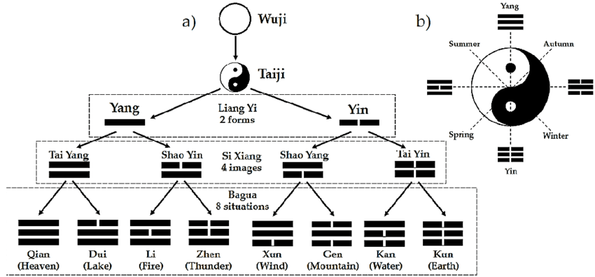

# I Ching

*read my article to get more insights on I Ching: 
[A Matter of Change](https://www.linkedin.com/pulse/matter-change-enhancing-resilience-embracing-i-ching-michael-talarek)

*[click on "Open in Colab" to run the code from Google Colaboratory](https://github.com/catch-twenty2/iching/blob/main/iching_ver_2.ipynb)

> *Still breathing? Now we gotta make the best of it, improvise,*  
> ***adapt to the environment, Darwin, shit happens, I Ching***,  
> *whatever man, we gotta roll with it.*  
> --Vincent (Tom Cruise) in "Collateral"

**Welcome to the insightful world of I Ching** – an ancient system of divination that offers invaluable insights into business, life matters, and the art of decision-making. It shares a unique perspective on the nature of change, the duality of existence, and the interconnectedness of all things. In the past it has intrigued scholars and thinkers for centuries. As an analyst with a deep interest in mental models, systems thinking, and change management, I explored the profound wisdom of I Ching for more than 10 years.

My method of casting resembles using three coins six times in order to generate six distinctive lines forming a hexagram. This is not the fast solution of generating one random number and in result can indicate which lines will change and how they affect the future outcome. As mystical as it may sound, this is so far the best key I found to unlock access to inner treasures of hidden thoughts. Otherwise decision-making and insights will be biassed too much by recent experiences.

## Using the Code
1. You can download the Python code from this repo and run it directly in your environment or click on the link above to run it in Colab. You don't need to write the full question actually, if you only want to get the hexagrams and explore the answers from suggested online resources. Then the links will be generated, and you will be instructed which hexagram and changing lines you should interpret. Still having a precise question formed before starting is essential for correct interpretation.

2. Additionally, a link will be generated to open personalized advice in Bing chat if you decide to provide your question in the first place. For that to work, however, you need to have installed the Edge browser, be logged in to your Microsoft account, and deliver the question in your prompt. Then, upon clicking the generated link, the question - along with selected hexagrams and changing lines - will be delivered directly to the chatbot. And there the personalized advice will be offered.

As much as ChatGPT operating behind Bing is (acting) smart, be aware that the interpretation of the hexagram might not match your personal situation totally, as software has no insights into your subconscious thoughts (that is, until Elon Musk will release his neuralinks... just kidding). That is why it is recommended to conduct the interpretation on your own, by reading descriptions of the selected hexagrams from websites I selected (or respected books, if you have them).

PS. Comments are welcomed when it comes to refactoring the code. As this is my first project of that scale, I had to cut the corners to iterate faster and get accuracy in calculations. Naming variables can also be nicer ;-)

PS2. Apparently the Bing AI modul is not always opening the browser, in that case you need to copy-paste the code.

## Receiving Consultation
1. Type your question: Enter your specific query in the prompt to seek guidance from I Ching.
2. Your First Hexagram: The initial reading will present your current situation in the form of a hexagram. Each line represents a certain aspect of your query, and it will be indicated which lines are changed if at all.
3. More Information and Analysis: Click on the provided links to explore detailed explanations of your first hexagram. These resources will offer further insights into the hexagram's meaning, the changing lines, and their significance.
4. The Reason for Change: The reading will highlight any changing lines in your hexagram, indicating potential areas of transformation or challenges you may encounter.
5. Your Second Hexagram (After Change): Discover the potential outcome of implementing the suggested changes. The second hexagram will represent your situation after the transformation, offering further guidance.
6. Further Analysis: Click on the links provided for your second hexagram to delve deeper into its interpretation and implications for your business.

## Questioning
Asking the right question is crucial when consulting I Ching, as it can significantly impact the quality of insights you receive. Here are some guidelines to frame effective questions:
1. Open-Ended: Avoid closed questions that can be answered with a simple "yes" or "no." Instead, ask open-ended questions that invite exploration and provide deeper insights.
2. Focused and Specific: Ensure your question is focused and specific, addressing a particular aspect of your life or situation. This helps to narrow the scope and receive clearer guidance.
3. Avoid "Should" Questions: Refrain from asking questions like "Should I do this?" or "Should I choose that?" I Ching is not about giving direct instructions; it offers guidance to empower your decision-making.
4. Reflect on Your Intentions: Before formulating your question, take time to introspect and understand your true intentions and motivations behind seeking guidance from I Ching.
5. Be Open-Minded: Maintain an open mind when receiving the answer. I Ching communicates through symbolism and metaphor, requiring thoughtful interpretation.

### Best Examples of Questions:
1. "What can I do to enhance my personal growth and self-awareness?"
2. "How can I navigate the challenges in my career while staying true to my values?"
3. "What insights can guide me to strengthen my relationships with loved ones?"
4. "What is the best approach to overcome the obstacles I'm facing in my current project?"
5. "What can I learn from my recent setbacks, and how can I use them as stepping stones for future success?"

### Worst Examples of Questions:
1. "Will I get the job I interviewed for yesterday?"
2. "Should I start a business in the tech industry or pursue a career in finance?"
3. "Will my partner and I stay together forever?"
4. "Should I invest in Stock A or Stock B?"
5. "Is this the right time to move to a different city?"

## Summary
The effectiveness of consulting I Ching lies in the process of introspection and self-awareness it encourages. When approaching the answers with an open mind, it stimulates deep reflection, helping individuals tap into their subconscious thoughts and feelings. As they meditate on the symbols and interpretations, they gain fresh perspectives and insights that may not have been apparent on the surface. I Ching acts as a mirror, reflecting the seeker's inner thoughts, emotions, and values, leading to a more profound understanding of themselves and their situation.

Let the wisdom of I Ching be your trusted companion, guiding you towards a deeper understanding of yourself, your decisions, and the world around you. Embrace this ancient oracle as a source of inspiration and reflection, and you will find its timeless teachings unfolding new dimensions of insight and self-awareness. 

[source](https://www.researchgate.net/figure/The-creation-of-yin-yang-and-Bagua-a-the-Taiji-symbol-b_fig1_349717685)
